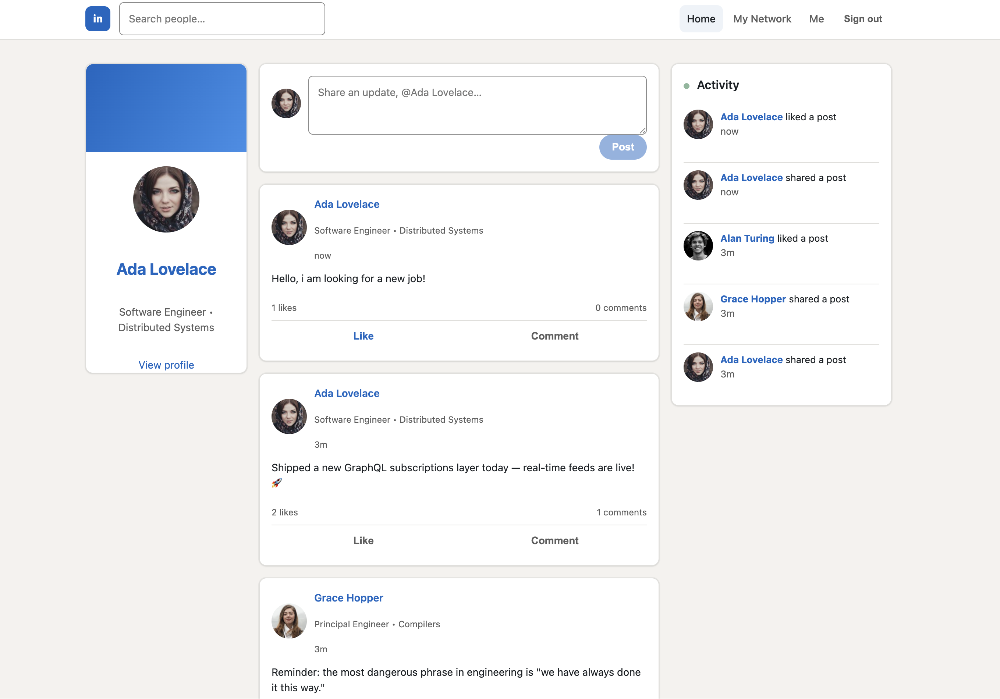
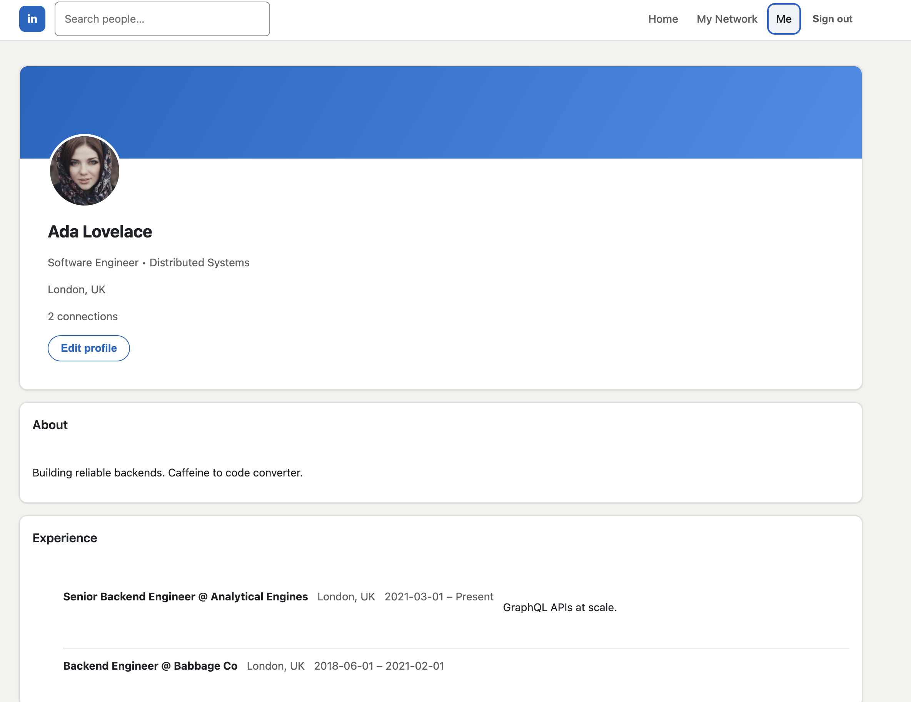
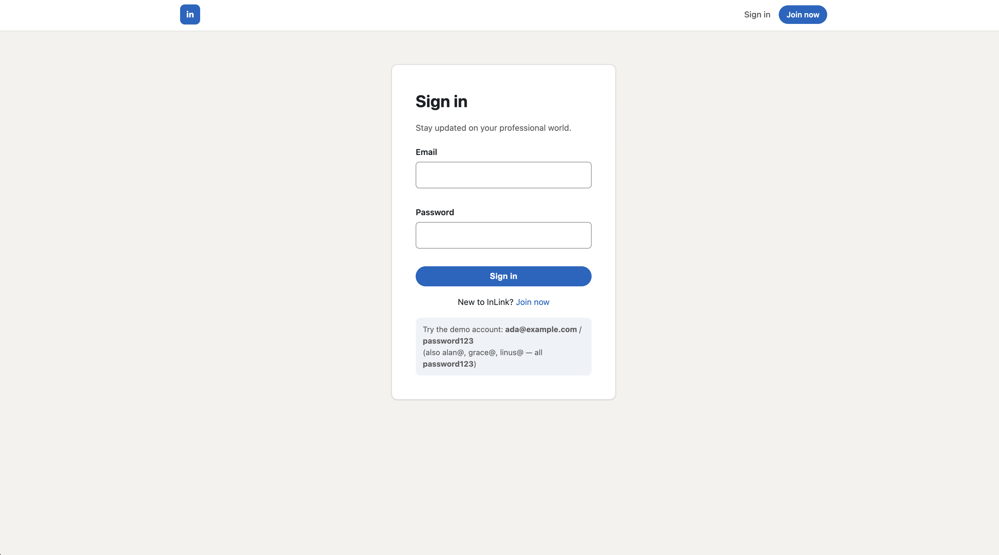

# InLink — a LinkedIn Clone

A full-stack professional networking app: authentication, profiles, posts, a
connection graph, and a **real-time activity feed** powered by an event-driven
pipeline (Kafka → Redis → GraphQL subscriptions).

> **Stack:** React (Vite) · Node.js · Express · GraphQL (Apollo) · PostgreSQL ·
> Redis · Apache Kafka · WebSocket subscriptions · JWT · Jest · Docker · GitHub Actions

> This is a ground-up modernization of an older CMPE-273 MERN/Kafka project. The
> original source is preserved under [`legacy/`](legacy/) for reference.

---

## 📸 Screenshots

The home feed — left profile card, post composer, the post feed, and the
real-time **Activity** sidebar that updates live over GraphQL subscriptions.



| Member profile | Sign in |
| :---: | :---: |
|  |  |

## ✨ Features

- **Authentication** — email/password signup & login with hashed passwords
  (bcrypt) and stateless **JWT** sessions.
- **Profiles** — headline, location, about, avatar, and work experience; users
  can edit their own profile inline.
- **Posts** — create posts, like/unlike (idempotent), and comment.
- **Connections** — send/accept/decline connection requests; your feed is built
  from your own posts plus those of your accepted connections.
- **Real-time activity feed** — every post/like/comment/connection emits an event
  that streams live to all clients over GraphQL subscriptions. No refresh needed.
- **Responsive, component-driven React UI** — reusable components and a small
  design-token system; works on mobile and desktop.
- **SEO-friendly** — semantic markup, per-page `<title>`/meta/Open Graph tags
  (react-helmet-async), JSON-LD structured data, and a sitemap-ready SPA.
- **Google Analytics 4** — optional, env-gated page-view + event tracking.

## 🏗️ Architecture

```
                    ┌──────────────────────────────────────────────────────┐
   React (Vite)     │  Apollo Client                                        │
   localhost:3000   │   • HTTP link  ──────────────► queries & mutations    │
                    │   • WS link    ──────────────► subscriptions (live)   │
                    └──────────────┬──────────────────────────┬─────────────┘
                                   │                           │
                              HTTP │                       WS  │  (graphql-ws)
                                   ▼                           ▼
                    ┌──────────────────────────────────────────────────────┐
   Node / Express   │  Apollo Server (GraphQL)  +  WebSocketServer          │
   localhost:4000   │  Resolvers ── Services ── DataLoader (N+1 batching)   │
                    └───┬───────────────┬───────────────┬──────────────┬────┘
                        │               │               │              │
                        ▼               ▼               ▼              ▼
                 ┌────────────┐   ┌──────────┐   ┌────────────┐  ┌──────────┐
                 │ PostgreSQL │   │  Redis   │   │   Kafka    │  │  Redis   │
                 │ (Knex)     │   │ (cache)  │   │  producer  │  │ PubSub   │
                 └────────────┘   └──────────┘   └─────┬──────┘  └────▲─────┘
                                                       │              │
                                                       ▼              │
                                                 ┌──────────────────────────┐
                                                 │ Kafka consumer            │
                                                 │ (activity-feed-fanout)    │
                                                 │  → publishes to RedisPubSub
                                                 └──────────────────────────┘
```

**Event-driven feed in one sentence:** a mutation writes to Postgres and produces
an `activity-events` Kafka message; a consumer fans that message out through a
Redis-backed PubSub, which drives the GraphQL `activityAdded` subscription to
every connected browser. If Kafka is unavailable, the same payload is published
directly to Redis PubSub so the feature degrades gracefully.

## 📁 Repository layout

```
.
├── server/                 # GraphQL API (Node, Express, Apollo, Knex, Kafka)
│   ├── src/
│   │   ├── graphql/        # schema (SDL) + resolvers
│   │   ├── services/       # business logic (users, posts, connections, activity)
│   │   ├── db/             # Knex instance, migrations, seeds
│   │   ├── redis/          # cache client + RedisPubSub
│   │   ├── kafka/          # client, producer, consumer (event pipeline)
│   │   ├── auth/           # password hashing + JWT
│   │   └── index.js        # HTTP + WebSocket server bootstrap
│   └── tests/              # Jest unit + integration tests
├── client/                 # React (Vite) SPA
│   └── src/
│       ├── components/     # reusable UI (NavBar, PostCard, ActivitySidebar, …)
│       ├── pages/          # Feed, Profile, Network, Search, Login, Signup
│       ├── graphql/        # typed operations (queries/mutations/subscriptions)
│       ├── apollo/         # Apollo Client (HTTP + WS split link)
│       ├── auth/           # AuthContext + token store
│       └── analytics/      # Google Analytics 4 wrapper
├── docker-compose.yml      # Postgres + Redis + Kafka (KRaft, no Zookeeper)
├── .github/workflows/ci.yml
└── legacy/                 # the original 2018 project, archived
```

## 🚀 Quickstart

**Prerequisites:** Node.js ≥ 18 and Docker (for Postgres, Redis, and Kafka).

```bash
# 1. Start infrastructure (Postgres :5433, Redis :6379, Kafka :9092)
docker compose up -d

# 2. API
cd server
cp .env.example .env
npm install
npm run db:reset      # migrate + seed demo data
npm run dev           # GraphQL at http://localhost:4000/graphql

# 3. Client (in a second terminal)
cd client
cp .env.example .env
npm install
npm run dev           # app at http://localhost:3000
```

Open http://localhost:3000 and sign in with a demo account:

| Email | Password |
| --- | --- |
| `ada@example.com` | `password123` |
| `alan@example.com` | `password123` |
| `grace@example.com` | `password123` |
| `linus@example.com` | `password123` |

> **Tip:** open the app in two browsers, post from one, and watch the activity
> panel update live in the other.

> **Why Postgres on port 5433?** The compose file maps host `5433 → 5432` so it
> won't clash with a Postgres you may already run locally. `DATABASE_URL` matches.

## 🔌 GraphQL API

The schema lives in [`server/src/graphql/schema.js`](server/src/graphql/schema.js).
Highlights:

```graphql
type Query {
  me: User
  user(id: ID!): User
  searchUsers(term: String): [User!]!
  feed(limit: Int, offset: Int): [Post!]!
  connections: [User!]!
  connectionRequests: [Connection!]!
  recentActivity(limit: Int): [Activity!]!
}

type Mutation {
  signup(input: SignupInput!): AuthPayload!
  login(email: String!, password: String!): AuthPayload!
  createPost(content: String!, imageUrl: String): Post!
  likePost(postId: ID!): Post!
  commentOnPost(postId: ID!, content: String!): Comment!
  sendConnectionRequest(userId: ID!): Connection!
  respondConnectionRequest(connectionId: ID!, accept: Boolean!): Connection!
}

type Subscription {
  activityAdded: Activity!          # the real-time feed
  postAdded(authorId: ID): Post!
}
```

Authenticated requests send `Authorization: Bearer <jwt>` (HTTP) or
`connectionParams: { authToken: "Bearer <jwt>" }` (WebSocket).

## 🧪 Testing

```bash
cd server
npm test          # Jest: auth, posts/feed/likes, connections, password hashing
```

Integration tests run against a dedicated `linkedin_test` database (created and
migrated automatically) with Kafka disabled, exercising the direct-PubSub
fallback path. CI runs the same suite plus a production client build on every
push — see [`.github/workflows/ci.yml`](.github/workflows/ci.yml).

## ⚙️ Configuration

| Variable | Where | Purpose |
| --- | --- | --- |
| `DATABASE_URL` | server | PostgreSQL connection string |
| `REDIS_URL` | server | Redis connection string |
| `KAFKA_BROKERS` | server | Comma-separated broker list |
| `KAFKA_ENABLED` | server | `false` to skip Kafka and use direct PubSub |
| `JWT_SECRET` | server | Signing secret for JWTs |
| `VITE_GRAPHQL_HTTP` / `VITE_GRAPHQL_WS` | client | API endpoints |
| `VITE_GA_MEASUREMENT_ID` | client | Google Analytics 4 ID (optional) |

See `server/.env.example` and `client/.env.example` for the full list. **No
secrets are committed** — provide your own via `.env`.

## 🔒 Security notes

- **JWT** signing secret is **required in production** (the app refuses to boot
  without `JWT_SECRET`); a weak default is permitted only in dev/test.
- **Email is owner-only** — the `User.email` field resolves to `null` for anyone
  but the account owner, preventing bulk PII harvesting via `searchUsers`/`user`.
- **GraphQL errors** never leak stacktraces in production (`formatError` +
  `includeStacktraceInErrorResponses`).
- **Rate limiting** guards the `/graphql` endpoint against brute-force/abuse.
- Passwords are hashed with **bcrypt**; all DB access uses parameterized Knex
  queries (no string-built SQL).

## ⚡ Performance notes

The feed avoids N+1 queries: **DataLoader** batches authors, like/comment counts,
comments, and the viewer's like state into one grouped query each per request.

## 📜 npm scripts

**server:** `dev`, `start`, `migrate`, `seed`, `db:reset`, `test`
**client:** `dev`, `build`, `preview`
**root:** `setup`, `db:reset`, `dev:server`, `dev:client`, `test`, `infra:up`, `infra:down`

## License

MIT — see [LICENSE](LICENSE).
